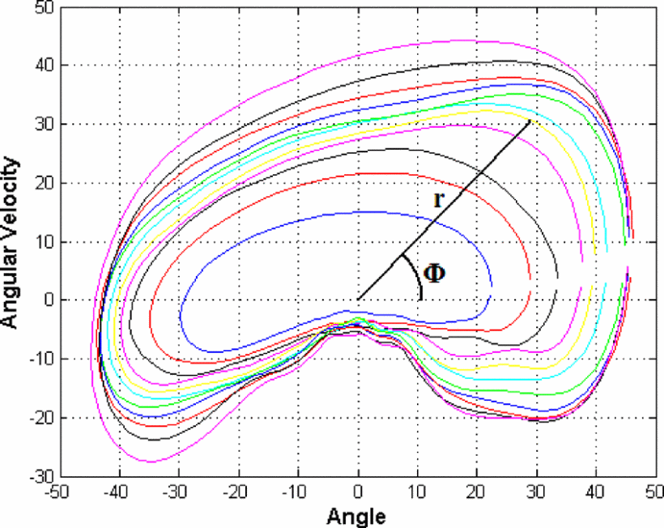
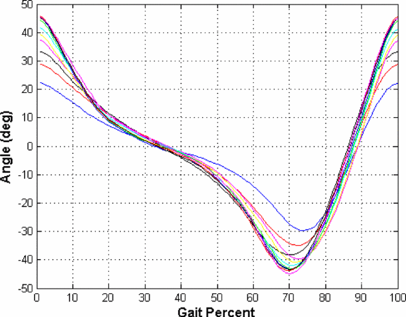
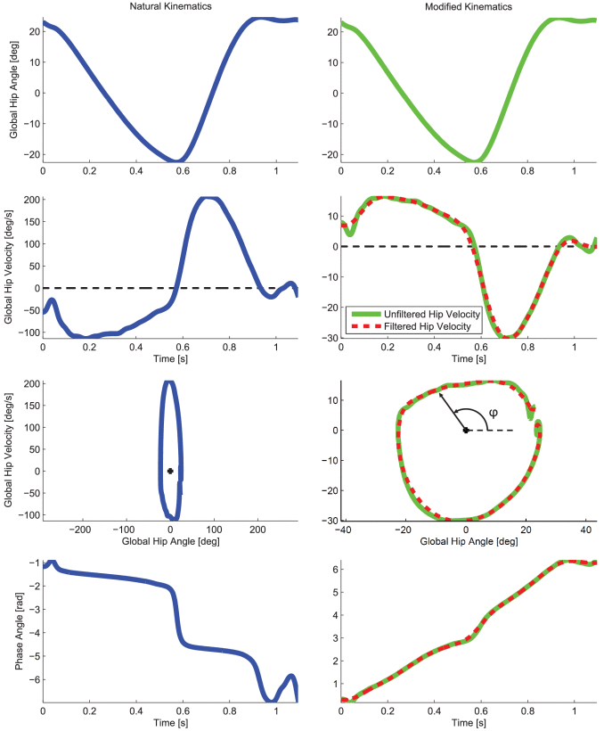
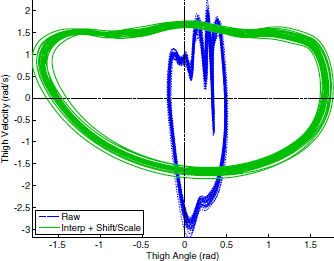
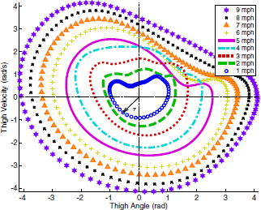

## Studies using phase portraits

|                Authors and year                 |                          Axes                          |                             Task                             |
| :---------------------------------------------: | :----------------------------------------------------: | :----------------------------------------------------------: |
|    [Holgate et al. 2009](#holgate-et-al2009)    |      Tibia angle & tibia scaled angular velocity       |               Continuous gait phase estimation               |
| [Villarreal et al.,2017](#villarreal-et-al2017) | Thigh angle & its derivative(estimated thigh velocity) |               Continuous gait phase estimation               |
|   [Quintero et al.,2017](#quintero-et-al2017)   | Thigh angle & its derivative(estimated thigh velocity) | Continuous gait phase estimation; gait speed estimation(as a byproduct) |
|   [Quintero et al. 2018](#quintero-et-al2018)   |               Thigh angle & its integral               |               Continuous gait phase estimation               |

## Holgate et al.,2009

Holgate et al.[^1]: The polar angle between the **tibia angle** and its **scaled angular velocity** has an invertible relationship with the gait phase and is not subject-dependent. 

Tibia angular velocity multiplied by a scaling factor versus tibia angle. The closer the curve is to the origin, the shorter the stride length. Polar angle $\Phi$ represents the progression around the curve based on gait percent. $r$ is the polar radius and is related to the stride length of the particular curve.

Tibia angle profile for able bodied human gait. Each curve represents a different stride length. The closer the curve is to the zero degree axis, the shorter the stride length.

## Villarreal et al.,2017

The phase portrait was scaled by a factor estimated by the ratio of difference in maximum phase angle and minimum phase angle to the difference in the first derivative of the same, so as to improve the monotonicity and linearity. These properties were further improved by filtering, at the expense of some delay. [^VV]

## Quintero et al.,2017

> The raw thigh orbit (raw) compared to the interpolated filtered, shifted/scaled thigh orbit (interp + shift/scale) in the phase plane for 20 continuous strides at 3 mph. Applying the shift and scale algorithm produces a circular orbit shape, in contrast to the raw non-circular orbit.[^Quintero2017]

> The phase portrait of $\dot\theta_y(t)$ vs. $θ_x(t)$ across various treadmill speeds (1–9 mph) each having 20 consecutive gait strides. The polar radius $r$ can be correlated to the subject's gait speed. speeds < 4mph produced a circular orbit from 0 to 2$\pi$ (i.e., 0% to 100% gait cycle). At 5 mph, the subject transitioned from fast walking to running, where more forceful ground impacts can be observed in the IMU measurements due to the flight phase. this produced a non-circular form after impact with intersection of other orbits at different speeds, as shown in the first quadrant for 5–6 mph.

## Quintero et al.,2018

Quintero et al.[^2]: **thigh angular position** and its corresponding **integral** to form a well-defined thigh orbit.

A phase angle $ \vartheta (t) $ is computed by utilizing thigh angular position $\phi(t)$ and its integral $\Phi(t)=\int ^t_0\phi(τ)dτ $in the following way:
$$
\begin{equation} \vartheta (t) = \mathrm{atan2}((\Phi (t) + \Gamma)z, (\phi (t) +\gamma)) \end{equation}
$$
where the scale factor z, the thigh angle shift γ, and the thigh integral shift Γ are given by
$$
\begin{eqnarray*} z &&= \frac{|\phi _{\rm max} - \phi _{\rm min}|}{|\Phi _{\rm max} - \Phi _{\rm min}|}, \; \\ \gamma &&= -\left(\frac{\phi _{\rm max} + \phi _{\rm min}}{2}\right), \; \ \ \Gamma = -\left(\frac{\Phi _{\rm max} + \Phi _{\rm min}}{2}\right). \end{eqnarray*}
$$

> Phase plane of the thigh angle ϕ(t) vs. its integral Φ(t) during prosthetic leg experiments (see Section IV). The phase plane has been scaled by z and shifted by (γ,Γ) to achieve a circular orbit across the stride, which improves the linearity of the phase variable ϑ(t).

[^1]: M. A. Holgate, T. G. Sugar, and A. W. Bohler, “A novel control algorithm for wearable robotics using phase plane invariants,” in 2009 IEEE International Conference on Robotics and Automation, pp. 3845–3850, Kobe, Japan, 2009.
[^VV]: D. J. Villarreal, H. A. Poonawala and R. D. Gregg, "A Robust Parameterization of Human Gait Patterns Across Phase-Shifting Perturbations," in *IEEE Transactions on Neural Systems and Rehabilitation Engineering*, vol. 25, no. 3, pp. 265-278, March 2017, doi: 10.1109/TNSRE.2016.2569019.
[^2]: D. Quintero, D. J. Villarreal, D. J. Lambert, S. Kapp, and R. D. Gregg, “Continuous-phase control of a powered knee-ankle prosthesis: amputee experiments across speeds and inclines,” IEEE Transactions on Robotics, vol. 34, no. 3, pp. 686–701, 2018.
[^Quintero2017]: D. Quintero, D. J. Lambert, D. J. Villarreal and R. D. Gregg, "Real-Time continuous gait phase and speed estimation from a single sensor," *2017 IEEE Conference on Control Technology and Applications (CCTA)*, 2017, pp. 847-852, doi: 10.1109/CCTA.2017.8062565.

