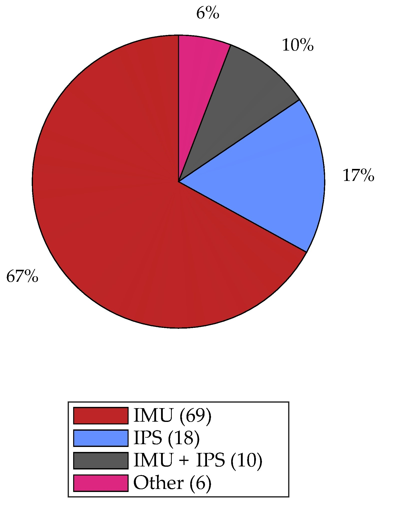
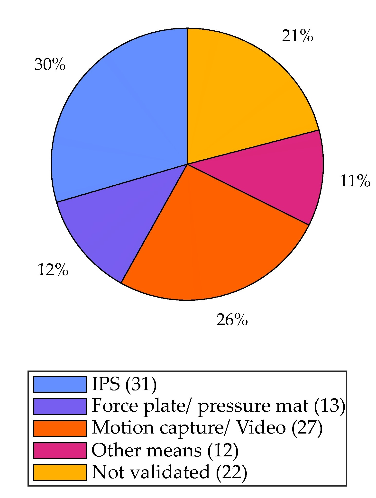

# Sensors for Gait Analysis

## Sensors
| 
Distribution of studies based on the type of wearable sensors used
 | 
(**b**) distribution of studies based on the type of sensors used for ground-truth validation of IMU-based gait analysis. Absolute number of studies in each category is listed within parentheses. IMU—inertial measurement unit, IPS—insole pressure sensor, EMG—electromyography sensor.
 |
| ------------------------------------------------------------ | ------------------------------------------------------------ |
|  |  |

insole pressure sensors

Number of studies using inertial measurement units (IMUs) that placed the sensor(s) on specific anatomical locations. Single placement contains studies where sensor(s) were placed only in one anatomical location. Placement combinations’ columns indicate studies where sensor(s) were placed in more than one location. Each relevant location is marked by a shaded cell and the number of studies using this combination is indicated at the bottom of the column. The total indicates the sum of studies where the sensor(s) were placed on that given anatomical location.
