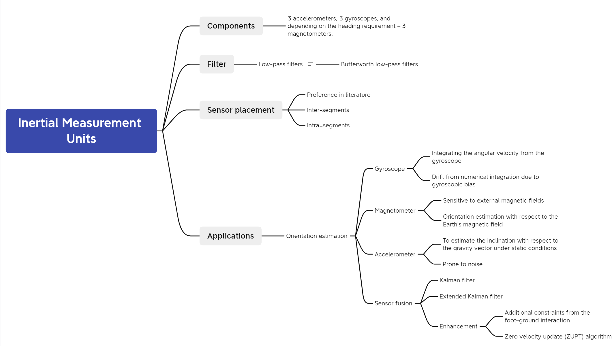

# Sensors for Gait Analysis

[TOC]
## Sensors
| 
Distribution of studies based on the type of wearable sensors used
 | 
Distribution of studies based on the type of sensors used for ==ground-truth validation of IMU==-based gait analysis. Absolute number of studies in each category is listed within parentheses. *IMU—inertial measurement unit, IPS—insole pressure sensor, EMG—electromyography sensor.*
 |
| ------------------------------------------------------------ | ------------------------------------------------------------ |
|  |  |

### Inertial Measurement Units

#### Sensor placement

##### Preference in literature

> Number of studies using inertial measurement units (IMUs) that placed the sensor(s) on specific anatomical locations. Single placement contains studies where sensor(s) were placed only in one anatomical location. Placement combinations’ columns indicate studies where sensor(s) were placed in more than one location. Each relevant location is marked by a shaded cell and the number of studies using this combination is indicated at the bottom of the column. The total indicates the sum of studies where the sensor(s) were placed on that given anatomical location.

##### (inter- and intra=) Segments to choose

Foot

- Li et al., 2016[^1]: compared IMU signals from the thigh, the shank and the foot, based on the <u>stability of “energy of acceleration”</u> which is the norm of raw acceleration minus gravity
- Jasiewicz et al., 2006[^2]: significantly more accuracy in <u>gait event detection</u> methods
- Taborri et al., 2014[^4]: better accuracy of a HMM-based classifier for <u>gait event detection</u> when using data of the foot.
- Wenger, N. et al., 2015[^5]: <u>neuro-behavioral experiments</u> suggesting that limb endpoints are the primary variables used to coordinate locomotion in animals and humans

Shank

- Bejarano et al., 2013[^6]: the root mean square error between each cycle (as well as the average)

Irrelevant (in some tasks)

- Mazilu et al., 2012[^3]: in the context of freezing of gait

Intra-segment

​	mount/socket; Anwary et al.[^7]: the medial arch followed by the Achilles tendon(also the centre point of foot length; location 1 🔽); based on accuracy of extracted features: Number of Strides, Distance, Speed, Stride Length, Stride Period, Stance Length, Stance Period, Swing Length, Swing Period and ratio of stance and swing

#### Filter

> 39 out of 69 studies at least used a preprocessing filter, 31 of which used a low-pass filter among which 15 used the Butterworth low-pass filter. Note that preprocessing filters add to the latency in data processing, which is undesirable in a real-time system.

#### Application

### Insole pressure sensors

Only six out of 28 studies related to IPS used any sort of preprocessing/filtering. Instead, these studies relied directly on the raw signal from the IPS, likely contributing to shorter latency, an advantage when it comes to real-time systems.

[^1]:Li, F.; Liu, G.; Liu, J.; Chen, X.; Ma, X. 3D Tracking via Shoe Sensing. *Sensors* **2016**, *16*, 1809. [[Google Scholar](https://scholar.google.com/scholar_lookup?title=3D+Tracking+via+Shoe+Sensing&author=Li,+F.&author=Liu,+G.&author=Liu,+J.&author=Chen,+X.&author=Ma,+X.&publication_year=2016&journal=Sensors&volume=16&pages=1809&doi=10.3390/s16111809)] [[CrossRef](https://doi.org/10.3390/s16111809)]
[^2]: Jasiewicz, J.M.; Allum, J.H.; Middleton, J.W.; Barriskill, A.; Condie, P.; Purcell, B.; Li, R.C.T. Gait event detection using linear accelerometers or angular velocity transducers in able-bodied and spinal-cord injured individuals. *Gait Posture* **2006**, *24*, 502–509. [[Google Scholar](https://scholar.google.com/scholar_lookup?title=Gait+event+detection+using+linear+accelerometers+or+angular+velocity+transducers+in+able-bodied+and+spinal-cord+injured+individuals&author=Jasiewicz,+J.M.&author=Allum,+J.H.&author=Middleton,+J.W.&author=Barriskill,+A.&author=Condie,+P.&author=Purcell,+B.&author=Li,+R.C.T.&publication_year=2006&journal=Gait+Posture&volume=24&pages=502–509&doi=10.1016/j.gaitpost.2005.12.017)] [[CrossRef](https://doi.org/10.1016/j.gaitpost.2005.12.017)]
[^3]: Mazilu, S.; Hardegger, M.; Zhu, Z.; Roggen, D.; Troster, G.; Plotnik, M.; Hausdorff, J.M. Online detection of freezing of gait with smartphones and machine learning techniques. In Proceedings of the 2012 6th International Conference on Pervasive Computing Technologies for Healthcare (PervasiveHealth), San Diego, CA, USA, 21–24 May 2012; pp. 123–130. [[Google Scholar](https://scholar.google.com/scholar_lookup?title=Online+detection+of+freezing+of+gait+with+smartphones+and+machine+learning+techniques&conference=Proceedings+of+the+2012+6th+International+Conference+on+Pervasive+Computing+Technologies+for+Healthcare+(PervasiveHealth)&author=Mazilu,+S.&author=Hardegger,+M.&author=Zhu,+Z.&author=Roggen,+D.&author=Troster,+G.&author=Plotnik,+M.&author=Hausdorff,+J.M.&publication_year=2012&pages=123–130)]
[^4]: Taborri, J.; Rossi, S.; Palermo, E.; Patanè, F.; Cappa, P. A novel HMM distributed classifier for the detection of gait phases by means of a wearable inertial sensor network. *Sensors* **2014**, *14*, 16212–16234. [[Google Scholar](https://scholar.google.com/scholar_lookup?title=A+novel+HMM+distributed+classifier+for+the+detection+of+gait+phases+by+means+of+a+wearable+inertial+sensor+network&author=Taborri,+J.&author=Rossi,+S.&author=Palermo,+E.&author=Patanè,+F.&author=Cappa,+P.&publication_year=2014&journal=Sensors&volume=14&pages=16212–16234&doi=10.3390/s140916212)] [[CrossRef](https://doi.org/10.3390/s140916212)]
[^5]:Wenger, N.; Moraud, E.M.; Raspopovic, S.; Bonizzato, M.; DiGiovanna, J.; Musienko, P.; Morari, M.; Micera, S.; Courtine, G. Closed-loop neuromodulation of spinal sensorimotor circuits controls refined locomotion after complete spinal cord injury. *Sci. Transl. Med.* **2014**, *6*, 255ra133. [[Google Scholar](https://scholar.google.com/scholar_lookup?title=Closed-loop+neuromodulation+of+spinal+sensorimotor+circuits+controls+refined+locomotion+after+complete+spinal+cord+injury&author=Wenger,+N.&author=Moraud,+E.M.&author=Raspopovic,+S.&author=Bonizzato,+M.&author=DiGiovanna,+J.&author=Musienko,+P.&author=Morari,+M.&author=Micera,+S.&author=Courtine,+G.&publication_year=2014&journal=Sci.+Transl.+Med.&volume=6&pages=255ra133&doi=10.1126/scitranslmed.3008325)] [[CrossRef](https://doi.org/10.1126/scitranslmed.3008325)]
[^6]:Bejarano, N.C.; Ambrosini, E.; Pedrocchi, A.; Ferrigno, G.; Monticone, M.; Ferrante, S. An adaptive real-time algorithm to detect gait events using inertial sensors. In Proceedings of the XIII Mediterranean Conference on Medical and Biological Engineering and Computing 2013, Seville, Spain, 25–28 September 2013; pp. 1799–1802. [[Google Scholar](https://scholar.google.com/scholar_lookup?title=An+adaptive+real-time+algorithm+to+detect+gait+events+using+inertial+sensors&conference=Proceedings+of+the+XIII+Mediterranean+Conference+on+Medical+and+Biological+Engineering+and+Computing+2013&author=Bejarano,+N.C.&author=Ambrosini,+E.&author=Pedrocchi,+A.&author=Ferrigno,+G.&author=Monticone,+M.&author=Ferrante,+S.&publication_year=2013&pages=1799–1802&doi=10.1007/978-3-319-00846-2_444)] [[CrossRef](https://doi.org/10.1007/978-3-319-00846-2_444)]

[^7]:Anwary, A.R.; Yu, H.; Vassallo, M. Optimal foot location for placing wearable IMU sensors and automatic feature extraction for gait analysis. *IEEE Sens. J.* **2017**, *18*, 2555–2567. [[Google Scholar](https://scholar.google.com/scholar_lookup?title=Optimal+foot+location+for+placing+wearable+IMU+sensors+and+automatic+feature+extraction+for+gait+analysis&author=Anwary,+A.R.&author=Yu,+H.&author=Vassallo,+M.&publication_year=2017&journal=IEEE+Sens.+J.&volume=18&pages=2555–2567&doi=10.1109/JSEN.2017.2786587)] [[CrossRef](https://doi.org/10.1109/JSEN.2017.2786587)]

